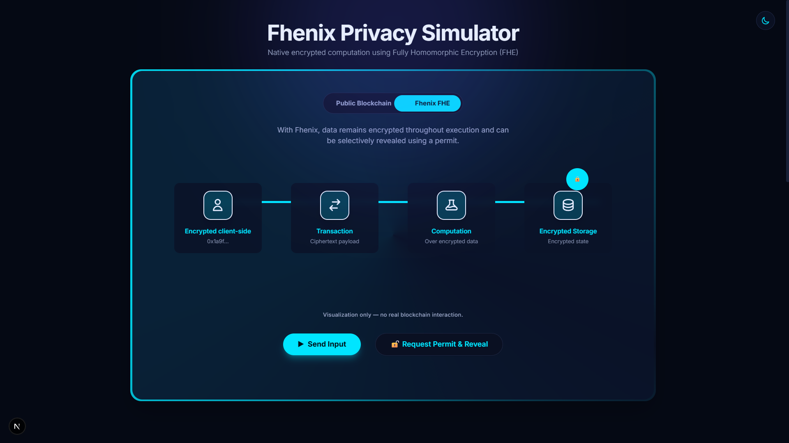

# Fhenix Privacy Simulator

Live Demo: [**fhenix-privacy-simulator.vercel.app**](https://fhenix-privacy-simulator.vercel.app)

This project is a front-end–only educational simulator designed to help users understand privacy concepts described in the Fhenix documentation.

It provides an interactive visualization of the conceptual model behind confidential computation using Fully Homomorphic Encryption (FHE).

 <!-- Replace with actual screenshot if available -->

## 🌟 Overview

This project simulates the difference between a traditional **Public Blockchain** (where all data is visible) and the **Fhenix FHE** approach (where data is represented as encrypted throughout the simulated computation flow). Users can toggle between modes to visualize the differing data flows, encryption states, and **privacy concepts**.

## 🚫 What This Simulator Does NOT Do

- No real blockchain interaction
- No real FHE execution
- No smart contracts
- No wallet connection
- No encryption or key handling
- Visualization only

## ✨ Key Features

- **Interactive Simulation**: Visualizes the flow of data from Input -> Transaction -> Execution -> Storage.
- **Dual Modes**:
    - **Public Blockchain**: Shows plaintext data exposed at every step.
    - **Fhenix FHE**: Demonstrates a **visual representation of encrypted data flow** with selective "Permit Reveal" functionality.
- **Custom Theme System**:
    - **Strict Fhenix Color Palette**: Deep Navy (`#050914`), Cyan Accents (`#00e5ff`), and Cool White (`#F5FAFF`) Light Mode.
    - **Variable-Based Theming**: Robust CSS variable architecture enabling instant, glitch-free Dark/Light mode switching.
    - **"Magic Border" Animation**: A custom conic-gradient spinning border effect on the simulator container.
- **Responsive Design**: Fully optimized for Desktop and Mobile with adaptive layouts using Tailwind CSS.

## 🛠️ Technology Stack

- **Framework**: [Next.js](https://nextjs.org/) (App Router)
- **Library**: React
- **Styling**: [Tailwind CSS](https://tailwindcss.com/)
- **Animation**: [Framer Motion](https://www.framer.com/motion/)
- **Language**: TypeScript


## 📂 Project Structure

```bash
fhenix-privacy-simulator/
├── public/
│   └── screenshot.png       # Preview image
├── src/
│   ├── app/
│   │   ├── favicon.ico
│   │   ├── globals.css      # Strict CSS Variable Theme System
│   │   ├── layout.tsx       # Theme State Management
│   │   └── page.tsx         # Main Landing Page
│   └── components/
│       ├── Simulator.tsx            # Core Logic Container
│       ├── FlowVisualizer.tsx       # Data Pipeline Animation
│       ├── ModeToggle.tsx           # Public/FHE Switch
│       ├── ThemeToggle.tsx          # Dark/Light Switch
│       ├── StageNode.tsx            # Pipeline Step Component
│       └── ApplicationPatterns.tsx  # Educational Cards
├── tailwind.config.ts       # Tailwind v4 Config
└── package.json
```

## �🚀 Getting Started

1.  **Clone the Repository**:
    ```bash
    git clone https://github.com/your-username/fhenix-privacy-simulator.git
    ```

2.  **Navigate to Directory**:
    ```bash
    cd fhenix-privacy-simulator
    ```

3.  **Install Dependencies**:
    ```bash
    npm install
    # or
    yarn install
    ```

4.  **Run Development Server**:
    ```bash
    npm run dev
    ```

5.  **Open Browser**:
    Navigate to [http://localhost:3000](http://localhost:3000)

## 🎨 Design System

The application uses a semantic styling engine defined in `globals.css`:

| Token | Light Mode Value | Dark Mode Value |
| :--- | :--- | :--- |
| `--bg-main` | `#F5FAFF` (Cool White) | `#050914` (Deep Space) |
| `--bg-panel`| `#FFFFFF` (White) | `#0a1022` (Dark Panel) |
| `--accent` | `#00CFE8` (Cyan) | `#00e5ff` (Neon Cyan) |
| `--toggle-bg`| `#000000` (Always Black) | `var(--bg-panel)` |

### Components
- **`Simulator.tsx`**: The core logic and layout controller.
- **`FlowVisualizer.tsx`**: Handles the animated pipeline and node states.
- **`ModeToggle.tsx`**: A custom "Capsule" toggle with "Magic Border" styling constraints.
- **`ThemeToggle.tsx`**: Manages global theme state via `localStorage` and `data-theme` attributes.

## 📄 License & Disclaimer

This project is an independent educational visualization and is not affiliated with or endorsed by the official Fhenix protocol.

Licensed under the MIT License.

---
*Built with ❤️ for privacy.*
